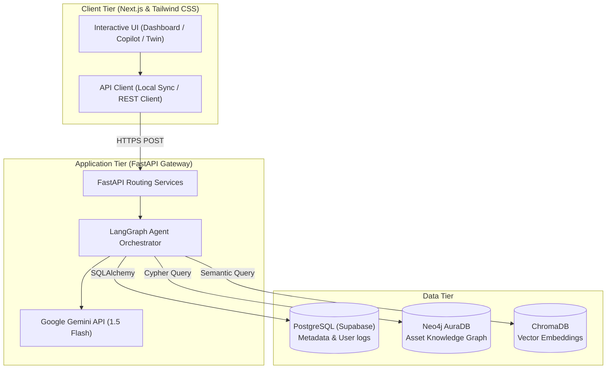

# IndustrialGPT OS: Unified Asset & Operations Brain
**An AI-Powered Operating System for Industrial Knowledge & Operations Intelligence**

---

[](https://github.com/PriyalKumar01/IndustrialGPT-OS/blob/main/LICENSE)
[](https://nextjs.org/)
[](https://fastapi.tiangolo.com/)
[](https://neo4j.com/)

A 2024 McKinsey survey found that professionals in asset-intensive industries spend **35% of their working hours** searching for scattered info. **IndustrialGPT OS** solves this fragmentation. It is an agentic AI operating system that ingests heterogeneous documents (P&IDs, drawings, OEM manuals) and connects them with live SCADA telemetry using a **Neo4j Knowledge Graph** and a **LangGraph Multi-Agent Engine** powered by **Google Gemini**.

---

## 🚀 Key Features

*   **🧠 Multi-Agent Copilot Workspace**: Chat with your plant manuals, safety SOPs, and historical data. View the AI's step-by-step reasoning nodes (`Planner -> RAG -> Neo4j -> Specialists -> Synthesizer`) with page-link citations.
*   **📊 Adaptive Operations Dashboard**: Features role-based displays (Operator, Manager, and Executive views) representing native RBAC constraints.
*   **📈 Predictive Maintenance & RCA**: Monitored digital twins showing real-time SCADA telemetry alerts and interactive **Ishikawa (Fishbone) failure diagrams** for root cause diagnostics.
*   **🛡️ Regulatory & Safety Compliance Gate**: Automatic check-offs for permits and audits mapped against local industrial safety codes (OISD-117, Factory Act, etc.).
*   **🔗 Interactive Knowledge Graph (Neo4j)**: Visual node-link network rendering relation maps between manuals, equipment, work orders, and safety regulations.
*   **🔌 Enterprise Integrations Hub**: Mock connection adapters and latency logs for systems like IBM Maximo, SAP S/4HANA, and SCADA OPC-UA.

---

## 📐 System Architecture



For an in-depth technical analysis and ROI statistics, see our **[Technical Whitepaper & Project Report](README_technical.md)**.

---

## 🛠️ Tech Stack

*   **Frontend**: Next.js, React 19, Tailwind CSS v4, Recharts, Lucide Icons.
*   **Backend**: FastAPI, LangGraph, Uvicorn, SQLAlchemy.
*   **Databases**: Supabase PostgreSQL, Neo4j AuraDB (Graph), ChromaDB (Vector DB).
*   **AI Model**: Google Gemini 1.5 Flash (LLM & Embeddings).

---

## 🏃‍♂️ Quick Start (Local Setup)

### Prerequisites
Make sure you have Node.js (v18+) and Python (v3.10+) installed.

### 1. Backend Configuration
1. Navigate to the backend directory:
   ```bash
   cd backend
   ```
2. Install Python dependencies:
   ```bash
   pip install -r requirements.txt
   ```
3. Create a `.env` file inside `backend/` and configure your API keys:
   ```env
   GEMINI_API_KEY=your_gemini_api_key_here
   DATABASE_URL=your_supabase_postgres_url_here
   NEO4J_URI=your_neo4j_auradb_bolt_uri_here
   NEO4J_USERNAME=neo4j
   NEO4J_PASSWORD=your_neo4j_auradb_password_here
   ```
4. Start the FastAPI server:
   ```bash
   python app/main.py
   ```
   The backend will be running at `http://localhost:8000`.

### 2. Frontend Configuration
1. Navigate to the frontend directory:
   ```bash
   cd ../frontend
   ```
2. Install Node dependencies:
   ```bash
   npm install
   ```
3. Start the Next.js development server:
   ```bash
   npm run dev
   ```
   Open `http://localhost:3000` in your browser.

4. **Toggle Real API mode**: 
   Open your browser developer console (`F12`) on the dashboard and run:
   ```javascript
   localStorage.setItem('USE_REAL_API', 'true')
   ```
   Refresh the page to route all AI chat queries through your live Gemini/Neo4j backend!

---

## ☁️ Deployment

*   **Frontend**: Deployed on **Vercel** (optimised Next.js build).
*   **Backend**: Deployed on **Render** (Docker/Python Web Service).
*   **Knowledge Graph**: Hosted on **Neo4j AuraDB Cloud**.
*   **Relational DB**: Hosted on **Supabase**.
