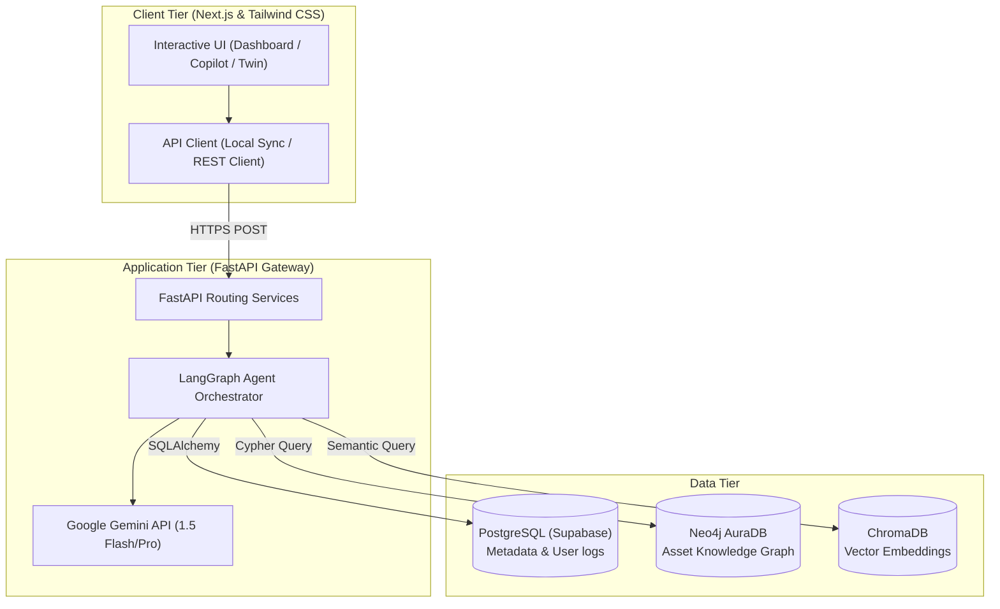
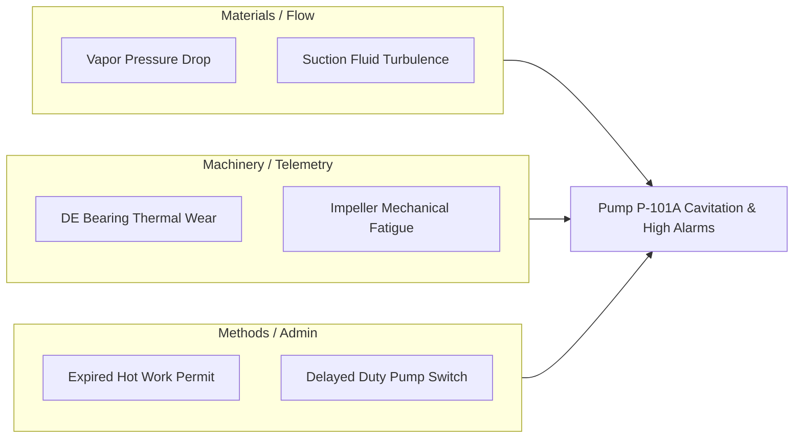

# IndustrialGPT OS: Technical Whitepaper & Project Report
**Unified Asset & Operations Brain for Industrial Knowledge Intelligence**

---

## 1. Executive Summary

In asset-intensive industries (such as refining, chemical manufacturing, and power generation), operational efficiency, safety, and compliance are directly bound to how effectively personnel access information. **IndustrialGPT OS** is an enterprise-grade AI-powered knowledge intelligence platform designed to ingest, relate, and serve heterogeneous document corpora at the point of need. 

By integrating a **Retrieval-Augmented Generation (RAG)** pipeline with a **Neo4j Knowledge Graph** and orchestrating them through a **LangGraph Multi-Agent State Machine**, IndustrialGPT OS bridges the gap between static documents and live plant operations. It features role-adaptive views, predictive maintenance diagnostics, Root Cause Analysis (RCA) support, and real-time regulatory compliance mapping, serving as a unified "operations brain" for heavy industry.

---

## 2. Industrial Context & Problem Statement

### 2.1 The Challenge of Knowledge Fragmentation
Modern heavy industrial plants suffer from extreme data silos. Important engineering drawings, process flow diagrams, piping and instrumentation diagrams (P&IDs), vendor manuals, maintenance history logs, and environmental regulations are scattered across disconnected local networks and proprietary software.

### 2.2 Core Market Statistics

| Metric / Statistic | Impact Area | Source |
| :--- | :--- | :--- |
| **35% of working hours** | Spent by professionals searching for info, clarifying guidelines, or recreating missing records. | *McKinsey Global Survey* |
| **7 to 12 disconnected systems** | Average software silos per large plant (e.g., P&IDs, SAP, OEM manuals, emails). | *NASSCOM-EY Manufacturing Study* |
| **18% – 22% unplanned downtime** | Caused directly by decision-making delays due to lack of asset history. | *BIS Research Estimate* |
| **25% workforce retirement** | Experienced industrial engineers retiring within the decade, causing a massive knowledge cliff. | *Indian Energy & Manufacturing Report* |

---

## 3. Platform Architecture

IndustrialGPT OS is engineered on a three-tier architecture combining a responsive Next.js frontend, an asynchronous FastAPI gateway, and a triple-database storage model.

### 3.1 Architecture Overview



---

## 4. Multi-Agent Reasoning Flow (LangGraph)

Instead of passing a query directly to a single LLM, IndustrialGPT OS routes queries through a multi-agent state machine built with **LangGraph**. This ensures complete transparency, auditing, and high confidence in industrial environments where safety limits are absolute.

### 4.1 Agent Execution Map

```mermaid
graph TD
    Start([User Query]) --> Planner[Planner Agent]
    Planner -->|Parallel Call| Retriever[Retrieval Agent (ChromaDB)]
    Planner -->|Parallel Call| Graph[Knowledge Graph Agent (Neo4j)]
    Planner -->|Parallel Call| Spec[Specialist Agents]
    
    subgraph Specialists ["Specialist Agents"]
        Maint[Maintenance Specialist]
        Comp[Compliance Auditor]
        Rca[RCA Engineer]
    end
    
    Retriever --> Synth[Answer Synthesizer]
    Graph --> Synth
    Maint --> Synth
    Comp --> Synth
    Rca --> Synth
    
    Synth --> End([Markdown Response + Citations])
```

### 4.2 Step-by-Step Agent Functions
1. **Planner Agent**: Analyzes the query, extracts equipment tags (e.g., `P-101A`), and sets planning boundaries.
2. **Retrieval Agent (RAG)**: Connects to **ChromaDB** using vector similarity to retrieve relevant paragraphs from safety SOPs and vendor manuals.
3. **Knowledge Graph Agent**: Queries **Neo4j** database to find surrounding nodes, active permits, and historical failure records linked to the asset tag.
4. **Maintenance Agent**: Evaluates sensor telemetry, calculates Remaining Useful Life (RUL), and diagnoses failure curves.
5. **Compliance Agent**: Checks safety rules (e.g., OISD-117, Factory Act) against active permits.
6. **RCA Agent**: Reconstructs fault trees and maps the primary cause of failures.
7. **Answer Synthesizer**: Compiles all outputs into a formatted Markdown report with citations.

---

## 5. Detailed Feature Walkthrough

### 5.1 Role-Adaptive Operations Dashboard
To accommodate the different needs of personnel inside an enterprise, the dashboard features **Role-Based Access Control (RBAC)**:
* **Operator Mode**: Prioritizes raw machine status, active SCADA vibration/temperature alarms, and critical warnings.
* **Manager Mode**: Focuses on document ingestion pipelines, compliance readiness index, and pending work orders.
* **Executive Mode**: Displays financial metrics, downtime prevention value ($), worker adoption rates, and energy efficiency charts.

### 5.2 Root Cause Analysis (RCA) & Ishikawa (Fishbone) Engine
For failures (like pump cavitation or compressor valve cracking), the platform automatically generates an **Ishikawa (Fishbone) diagram** mapping potential causes:



---

## 6. Business Impact & ROI Model

A standard refinery processing 150,000 barrels per day suffers an average of 4-6 unplanned shutdown events per year. Implementing IndustrialGPT OS mitigates these events through early detection and rapid prescription:

### 6.1 Projected Financial Benefits (Single Plant)

| Department / Target | Traditional Operations | With IndustrialGPT OS | Net Benefit |
| :--- | :--- | :--- | :--- |
| **Information Search Time** | 2.1 hours / engineer / day | 12 minutes / day | **90% Time Saved** |
| **Average Time-to-Resolution (TTR)**| 4.2 hours per incident | 48 minutes per incident | **80% Faster TTR** |
| **Unplanned Downtime Cost** | $1.2M annually | $360K annually | **$840K Savings (70% reduction)** |
| **Compliance Penalties** | $150K average annually | $0 (automated blocks) | **$150K Saved** |
| **Total Annual ROI** | — | — | **$990,000 / Plant** |

---

## 7. Technical Specifications & Integrations

### 7.1 Tech Stack
* **Frontend**: Next.js (TypeScript), Tailwind CSS (v4), Lucide Icons, Recharts (data visualizations), D3.js (Knowledge Graph network rendering).
* **Backend**: FastAPI (Python), LangGraph (Agentic state machine), Uvicorn (web server), SQLAlchemy (PostgreSQL ORM).
* **Database Services**: Supabase (Postgres Database), Neo4j AuraDB (Graph Database), ChromaDB (Vector database).

### 7.2 Enterprise Software Connectors
IndustrialGPT OS is built to connect to existing plant infrastructure using standardized adapters:
1. **IBM Maximo / SAP S/4HANA**: For synchronizing maintenance work orders and assets.
2. **OPC-UA / SCADA MES**: For capturing live telemetry events (vibration, flow rate, pressure, temperature).
3. **Document Management Systems (DMS)**: Direct connectors to sync folders, email archives, and PDF records.
